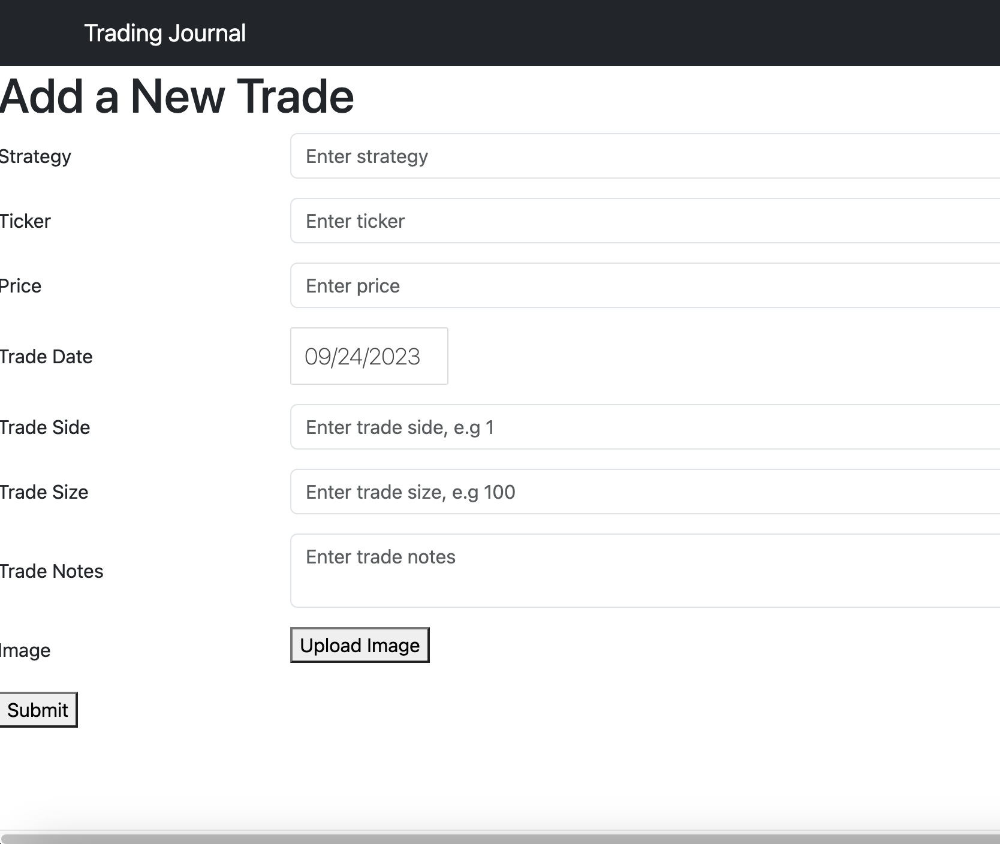
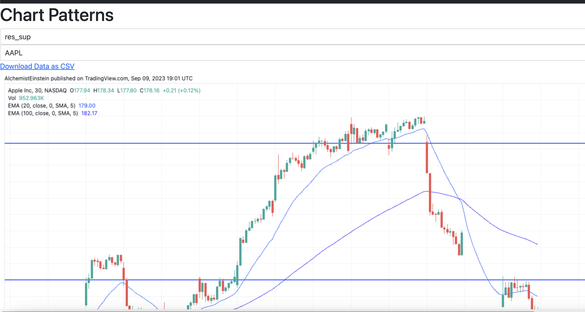
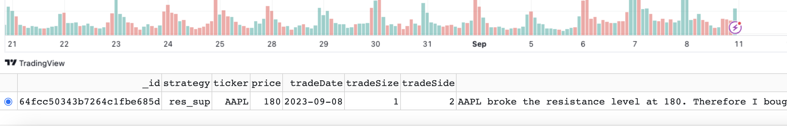

# Reinforce your trades with trades

`reinforce-trader` is an open-source trading journal app that provides a comprehensive solution for trader to track, analyse and improve their trading strategies. The best way to learn anything is to learn from your own mistakes. `reinforce-trader` aims to provide a solution for traders so that they can maintain a systematic approach to *"reinforce"* their trading strategies.

`reinforce-trader` emphasizes the use of technical pattarns when traders make trading decisions. Traders often use technical patterns to find entry points and exit points. e.g Drawing lines of resistance levels and supporting levels, Drawing a triangle pattern, ...etc. Therefore, `reinforce-traders` allows you to upload an image to capture the moment of trade. I personally use [TradingView](https://www.tradingview.com/) to draw lines and you can easily download the chart image using Tradingview's "Take a Snapshot" function.


## OS
Currently the application was only tested on MacOS.


## How to start
### 1. Make a copy of .env.sample and rename it as .env
```bash
cp .env.sample .env
```

### 2. Start with docker
```bash
# `docker compose up -d --build` if you want to rebuild it
docker compose up -d
```

### 3. Open the app
You can start adding new trades in your trading journal: [localhost:8050/add-trade](http://localhost:8050/add-trade)

## How to use
### Add a new trade
You can add a new trade on [localhost:8050/add-trade](http://localhost:8050/add-trade)



### View your trades
You then can view all your trades on [localhost:8050/trades](http://localhost:8050/trades)

Study the chart pattern



View the trade records



### (Coming soon) View your entry and exit points on the candlestick


# Roadmap
- Gather publicly available data as much as possible -> Datalake
- Extract information and knowledge from the publicly available data as much as possible -> research
- Build trading strategies using the information and knowledge from data -> trading system


# Research pipeline
A flexible and modularized pipeline to build machine learning models for financial data

1. prepare the datalake template
```bash
python generate_datalake_template.py
```

2. download historical market data
```python
import os

from reinforce_trader.research.datalake_client import DatalakeClient

datalake_dir = os.path.abspath(os.path.join(os.path.dirname(__file__), 'data'))
template_file_path = os.path.abspath(os.path.join(os.path.dirname(__file__), 'datalake_template.yaml'))
dl_client = DatalakeClient(datalake_dir, template_file_path)

dl_cleint.download_all()  # download all historical data of tickers from the template
```

3. run the classifier_v1 pipeline
```bash
python classifier_v1.py
```

# TODO
- need sanity checking for the feature pipeline, e.g need to know the distribution of the labels in case of inbalanced target.
- need to analyse the feature (input, output, input vs output) to understand the effect of the featurizer.
- add regularizers to tackle overfitting
- add samplers to tackle data inbalance
- seperate data layer (including feature pipeline) from the model? (YES, you need 2 models from the same feature pipeline)
- refactor code for data layer and clustering


# References
1. https://medium.com/@masteringllm/mastering-react-prompting-a-crucial-step-in-langchain-implementation-a-guided-example-for-agents-efdf1b756105
2. suggestions on fastapi application: https://www.youtube.com/watch?v=HTSK6eRwyGM
3. why do we need to detrend?: https://www.svds.com/avoiding-common-mistakes-with-time-series/
4. classifying sequences using unsupervised learning: https://datascience.columbia.edu/wp-content/uploads/2020/12/33_JPMorgan_Identifying-Trading-Opportunities.pdf
5. wiki of entropy: https://en.wikipedia.org/wiki/Entropy_(information_theory)


